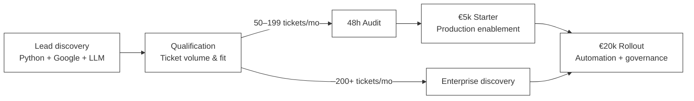
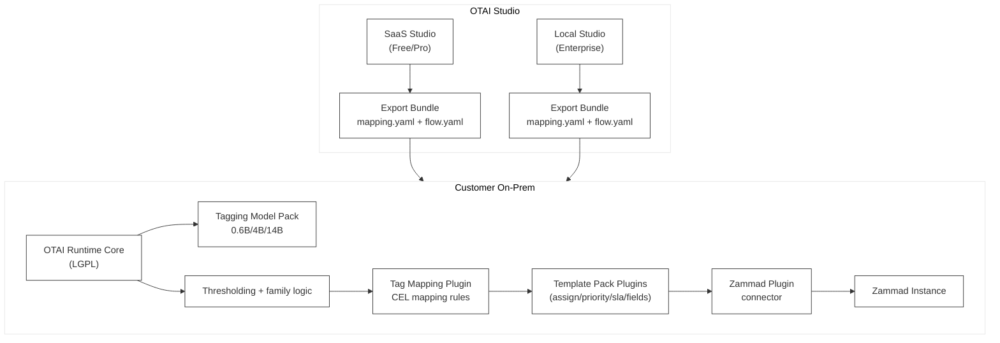
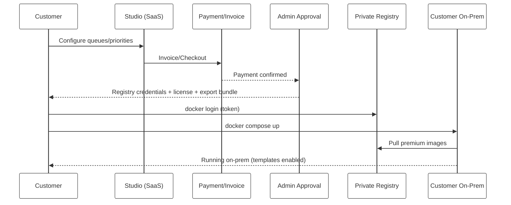

# Open Ticket AI — Marketing, Sales, Product & Delivery Strategy (Chat Summary)

## Executive summary

* **Pricing & economics:** Main offers discussed are **€5k (Pro/Starter)** and **€20k (Enterprise/Rollout)** with **very high gross margin (~99%)**, enabling unusually aggressive spend on lead generation, partner incentives, and “risk reversal” offers.
* **ROI thresholds:** You stated customers reach positive ROI roughly at **~50 tickets/month for €5k** and **~200 tickets/month for €20k**. This becomes the backbone of qualification, messaging, and funnel design.
* **Go-to-market reality:** Classic SEO is currently weak because there is **low explicit search demand** for terms like “Zammad AI / OTOBO AI”. Ranking for head terms (“Zammad”, “OTOBO”) is difficult. Therefore, **direct lead generation (programmatic outbound) + partners** should be the primary acquisition motion, with SEO only as a supporting layer (integration/problem content).
* **Core differentiation:** Since you ship **on-prem** (your USP), customers will have the model bits locally. Therefore, the long-term moat cannot be “weights secrecy”; it must be **system value**: mappings, templates, automations, governance, integrations, and operational reliability.
* **Delivery & monetization:** The simplest commercial gating is **Free vs Premium plugin/template access**, shipped via **Docker images + Docker Compose**, with **private images** for paid tiers. Payment unlock can be handled by a manual approval process issuing a token/licence and registry access.

---

## Key entities and scope discussed

* Company/product: Open Ticket AI
* Ticket system integration focus: Zammad, OTOBO, Znuny
* Delivery/runtime ecosystem: Docker, GitHub (for private registries / distribution)
* LLM integration options: OpenAI (as an optional provider, not required)

---

## 1) Pricing, margin, and what it enables

### What high margin + €5k/€20k pricing enables

* **Higher CAC tolerance** than typical SaaS: you can afford more spend per qualified opportunity.
* **Partner/referral economics:** paying meaningful referral fees still leaves ample margin.
* **Risk reversal:** pilots, guarantees, credits toward upgrades, and other “low-risk to try” structures.
* **ABM-light:** narrow targeting and higher spend per target account can be rational if the qualification is strong.

### ROI-based segmentation (your thresholds)

* **€5k (Pro/Starter)** is compelling at **~50 tickets/month**
* **€20k (Enterprise/Rollout)** is compelling at **~200 tickets/month**

This naturally forms a qualification rule:

* <50 tickets/month: deprioritize (too early)
* 50–199: steer into €5k package
* ≥200: steer to €20k (or €5k as a fast entry if procurement is slow)

---

## 2) Go-to-market strategy: why outbound + partners dominate (for now)

### Observations you made

* Very few prospects actively search “Zammad AI / OTOBO AI”
* Ranking for “Zammad” / “OTOBO” is highly competitive

### Strategic conclusion

* **Primary acquisition:** direct lead generation (programmatic outbound) + partner channel
* **Secondary:** focused SEO that matches *problem intent* and *integration intent* (not head terms)

### Channel priority (current state)

| Channel                                       | Priority | Why                                               |
| --------------------------------------------- | -------: | ------------------------------------------------- |
| Programmatic outbound (Python + Google + LLM) |    ⭐⭐⭐⭐⭐ | Creates demand when search demand is low          |
| Partners (integrators/MSPs/consultancies)     |    ⭐⭐⭐⭐⭐ | They already sit inside target accounts           |
| Product-led “free download” (open weights)    |       ⭐⭐ | High theft/commodity risk in on-prem distribution |
| SEO (head terms: “Zammad”, “OTOBO”)           |        ⭐ | Hard to rank, low direct intent for AI add-ons    |
| SEO (integration/problem content)             |      ⭐⭐⭐ | Useful supporting channel; long-term compounding  |

---

## 3) Sales motion and offers (deal flow)

### Recommended funnel structure

* **Entry offer:** “48h Ticket Audit” (or similar fast assessment)
* **Conversion offer:** €5k Starter (fast time-to-value)
* **Expansion offer:** €20k Enterprise Rollout

### Why this structure fits your market

* Prospects often have the problem but don’t search for it explicitly.
* The audit gives immediate value and reduces perceived risk.
* The €5k offer becomes the “foot-in-the-door” that can expand to €20k.

### Risk reversal ideas discussed (enabled by margin)

* Credit the €5k into €20k if upgrading within a defined window.
* KPI-based pilot framing (clear success criteria).
* Clear “what you get in X days” packaging.

---

## 4) Resource allocation: development-first, sales handled by partner

### Your constraint

* You want **more time in development**
* **Constanze handles sales**
* Need to decide whether to invest money into freelancers/agency

### Conclusion reached

* Avoid generic marketing agencies (especially pure SEO/content agencies) at this stage.
* Put budget into **assets that scale**:

  * improving the **lead discovery script**
  * enrichment + scoring + outreach automation tooling
  * partner enablement materials (templates, docs, bundles)

### Practical spend idea

* Hire a **strong Python/data automation freelancer** to turn your lead script into a repeatable “Lead OS”.
* Optionally later add an outbound SDR/assistant for list cleaning + first-touch, but your script is the main leverage.

---

## 5) Product architecture (runtime, plugins, templates, studio)

### Components you described

* **Tagging models by tier**

  * Free: Qwen3 0.6B, ~100 tags
  * Pro: Qwen3 4B, ~200 tags
  * Enterprise: Qwen3 14B, ~400 tags (still under consideration for broader suite)
* **Python runtime program**

  * Loads the model
  * Applies thresholding logic (e.g., family highest confidence)
* **OTAI Runtime Core (LGPL)**

  * Flow/pipeline/workflow engine
* **OTAI Tag Mapping plugin**

  * Maps tags to downstream values via CEL-defined mapping rules
* **Zammad integration plugin**

  * Integration exists, currently beta
* **Template plugins**

  * Provide prebuilt flows for: queue/group assignment, priority, SLA, custom fields, etc.
* **OTAI Studio / Console / Control Plane**

  * Mapping Studio generates mapping YAML configs from queues/priorities/etc.
  * Deployment model decided: **Enterprise local**, **Free/Pro SaaS**

---

## 6) Free vs Pro vs Enterprise strategy (and “theft” concern)

### Core issue you raised

* On-prem means the **model can be copied** once delivered.
* A naive “free model download” can accelerate competitors.

### Important implication

* Because you ship on-prem, the moat must be **beyond weights**:

  * templates, mapping logic UX, integration quality, governance, deployment simplicity, updates

### Simplest gating strategy agreed

* **Gate by plugin/template availability**, not by ticket counts.
* Implement Free vs Premium as separate plugin packages (Free plugin vs Premium plugin).

### Suggested tiering (high-level)

| Tier              | Models/Tags                            | Templates/Actions                                     | Studio       |
| ----------------- | -------------------------------------- | ----------------------------------------------------- | ------------ |
| Free              | 0.6B / ~100 tags                       | only basic queue/group template                       | SaaS Studio  |
| Pro (€5k)         | 0.6B/4B, more tags, more quantizations | + priority + custom fields + richer routing templates | SaaS Studio  |
| Enterprise (€20k) | up to 14B / ~400 tags + suite          | + SLA + governance + audits + multi-flow              | Local Studio |

---

## 7) Delivery & access control (Docker/Compose + plugins)

### Your preferred delivery

* **Docker images + Docker Compose** for simplest customer install.

### Main design decision

* Don’t load premium Python packages at runtime via pip if you can avoid it.
* Prefer **private Docker images** for premium packs (and/or runtime-pro images).

### Recommended distribution pattern

* **Public images**: runtime + free plugins
* **Private images**: premium plugin packs, premium model packs, enterprise extras
* Access control:

  * Customer gets registry access after payment
  * Customer gets a licence/token (optional but recommended)
  * Compose pulls the private images

### Why “API key loads packages” is weaker

* More operational complexity (pip, proxies, TLS, retries, caching)
* More failure modes for customers
* Harder to support air-gapped scenarios

---

## 8) Mapping Studio: SaaS vs On-Prem and “On-Prem USP confusion”

### Concern you raised

* On-prem is your USP; SaaS Studio might confuse or scare buyers.

### Resolution

* Message it as: **runtime + inference always on-prem**; Studio is just a **YAML generator**.
* Offer both modes:

  * **SaaS for Free/Pro** (fast onboarding)
  * **Local Studio for Enterprise** (compliance expectation)

### Practical UX mitigation

* Provide “No storage mode” in SaaS (generate → export; minimal persistence).
* Make the export bundle identical between SaaS and local Studio so customers see it as “the same product”.

---

## 9) Mapping generation with LLM (SaaS and On-Prem)

### Your plan

* Use an LLM to generate mapping YAML/CEL based on:

  * queues + descriptions
  * priorities + descriptions
  * desired assignments/automation logic

### On-Prem mapping generation options discussed

* Use a local model (e.g., 14B) for higher quality mapping drafts.
* Alternatively allow a “provider” approach:

  * local model
  * customer-provided key (OpenAI/Azure) if allowed
  * template/rule-based fallback

### Key technical insight

* Mapping generation quality depends heavily on:

  * strong schema constraints
  * allowed-value lists (queues/priorities/fields)
  * validation + review UI
  * template scaffolding (avoid “free-form CEL hallucinations”)

---

## 10) Open questions and decisions pending

### Decisions pending

* Whether Enterprise is “just 14B + 400 tags” or a broader automation/governance suite.
* How strict SaaS Studio persistence should be for Pro customers (persist vs no-storage mode).
* Whether you want any public “free model” distribution beyond the simplest baseline.

### Potential future improvements

* Enterprise-grade governance:

  * mapping versioning, approvals, audit reports
* Partner enablement:

  * standardized templates per ticket system
* Lead OS:

  * scoring model for “ticket volume likelihood”
  * automated enrichment and personalized outreach drafts

---

## Recommended “next concrete steps”

1. **Define SKU boundaries by templates/actions**

   * Free: only queue/group assignment template
   * Pro: + priority + custom fields + richer routing templates
   * Enterprise: + SLA + governance + multi-flow packs
2. **Standardize the Studio export bundle**

   * same files for SaaS and local Studio
3. **Implement premium distribution via private images**

   * keep Python plugins inside images
4. **Strengthen the mapping generator**

   * schema constraints + validator + “draft → review → export”
5. **Invest budget into the lead engine**

   * scale the Python + Google + LLM pipeline
   * add scoring + segmentation using your ROI thresholds

---
