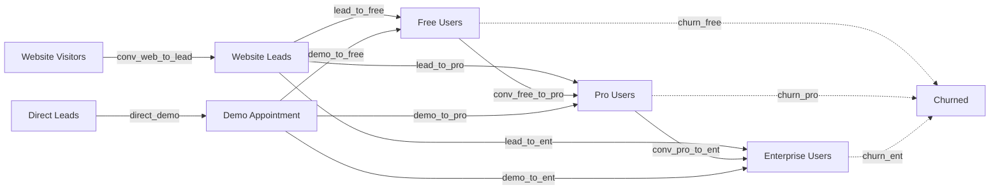

# OTAI Default Assumptions

This document outlines the default assumptions and parameters used in the OTAI Financial Forecasting System. These values drive the simulation's behavior and represent realistic business metrics for a B2B SaaS company.

The simulation models monthly business operations including customer acquisition, conversion funnels, pricing strategies, operating costs, and financial dynamics. Each section below explains a key aspect of the business model.

## Simulation Overview

The simulation runs on a monthly basis for a specified period, starting with initial cash and tracking all financial metrics. Users are acquired through paid ads and SEO efforts.

The market cap multiple determines the company's valuation based on trailing twelve-month (TTM) revenue, while the tax rate is applied to profits for cash flow calculations.

| Metric | Value |
| --- | --- |
| Months | 24 |
| Starting cash | 25,000.00 EUR |
| Market cap multiple | 4.00x |
| Tax rate | 25.00% |

## Acquisition Levers

The simulation models three primary customer acquisition channels, each with distinct cost structures and effectiveness metrics.

### Ads (CPC model)

Paid advertising operates on a cost-per-click (CPC) model with diminishing returns. As spend increases, the effective CPC rises due to increased competition and audience saturation.

The sensitivity factor determines how quickly CPC increases with spend, while the reference spend provides a baseline for calculations.

| Parameter | Value |
| --- | --- |
| Base CPC | 2.00 EUR |
| CPC sensitivity | 0.40 |
| CPC reference spend | 2,000.00 EUR |

### SEO (Domain rating + organic lift)

SEO investment improves domain authority and organic search visibility. The domain rating (DR) starts at an initial value and can increase up to a maximum based on SEO spend.

DR naturally decays over time without ongoing investment, requiring consistent spend to maintain rankings. The users per EUR ratio represents the organic traffic generated per euro of SEO investment.

| Parameter | Value |
| --- | --- |
| Users per EUR | 0.50 |
| Domain rating init | 1.00 |
| Domain rating max | 100.00 |
| DR spend sensitivity | 0.10 |
| DR reference spend | 100.00 EUR |
| DR monthly decay | 2.00% |

## Conversion Funnel

The conversion funnel tracks user progression through various stages, from initial website visit to paid subscription. The model includes both website-driven conversions and direct outreach efforts.

### Website funnel

Website visitors convert to leads at a base rate, then can be acquired as free, pro, or enterprise users. The conversion rates reflect typical B2B SaaS metrics where free trials have higher conversion than paid plans.

| Step | Conversion |
| --- | --- |
| Web -> Lead | 5.00% |
| Lead -> Free | 40.00% |
| Lead -> Pro | 1.00% |
| Lead -> Enterprise | 0.50% |

### Direct outreach funnel

Direct outreach targets qualified leads through personalized contact. This channel typically has higher conversion rates but requires more manual effort. The funnel progresses from contacted leads to demo appointments to conversions.

| Step | Conversion |
| --- | --- |
| Direct lead -> Demo | 1.00% |
| Demo -> Free | 10.00% |
| Demo -> Pro | 10.00% |
| Demo -> Enterprise | 5.00% |

### Upgrades and churn

Users can upgrade between tiers over time, with free users potentially becoming pro users, and pro users upgrading to enterprise. Churn represents the monthly percentage of users who cancel their subscriptions in each tier.

| Step | Rate |
| --- | --- |
| Free -> Pro | 1.00% |
| Pro -> Enterprise | 0.50% |
| Churn (Free) | 5.00% |
| Churn (Pro) | 5.00% |
| Churn (Enterprise) | 5.00% |

### Conversion diagrams

## Pricing Milestones

Pricing evolves as the product gains value through development. Each milestone represents a stage where the product value justifies higher pricing. The pro and enterprise prices increase as the minimum product value threshold is met.

This models a real-world scenario where SaaS companies increase prices as their product becomes more valuable and feature-rich.

| Milestone | Product value min | Pro price | Enterprise price |
| --- | --- | --- | --- |
| v1 | 0.00 EUR | 2,500.00 EUR | 10,000.00 EUR |
| v2 | 100,000.00 EUR | 5,000.00 EUR | 20,000.00 EUR |
| v3 | 250,000.00 EUR | 6,000.00 EUR | 22,500.00 EUR |
| v4 | 500,000.00 EUR | 6,500.00 EUR | 25,000.00 EUR |
| v5 | 1,000,000.00 EUR | 8,000.00 EUR | 30,000.00 EUR |
| v6 | 2,500,000.00 EUR | 9,000.00 EUR | 35,000.00 EUR |

## Sales & Support Costs

Sales costs are incurred when acquiring new paid customers, reflecting the effort needed to close deals. Support costs are ongoing expenses per customer, with some covered by subscription fees and take rates.

The support fee percentage represents what customers pay for premium support, while the take rate shows what percentage actually opt for paid support.

| Parameter | Value |
| --- | --- |
| Sales cost / new pro | 200.00 EUR |
| Sales cost / new enterprise | 200.00 EUR |
| Support cost / pro | 200.00 EUR |
| Support cost / enterprise | 600.00 EUR |
| Support fee pct (pro) | 5.00% |
| Support fee pct (ent) | 5.00% |
| Support take rate (pro) | 70.00% |
| Support take rate (ent) | 90.00% |

## Partner Program

The partner program leverages third-party resellers to acquire customers. Partners generate deals based on their investment and the product's value proposition. The commission rate reflects the partner's share of revenue.

Partner churn represents the monthly loss of partners, while deals per partner per month show the expected sales velocity from active partners.

| Parameter | Value |
| --- | --- |
| Partner spend ref | 1,000.00 EUR |
| Partner product value ref | 100,000.00 EUR |
| Partner commission rate | 25.00% |
| Partner churn / month | 2.00% |
| Pro deals / partner / month | 0.50 |
| Enterprise deals / partner / month | 0.10 |

## Operating Costs

Operating costs include both fixed baseline expenses and variable costs that scale with user count and development investment. The per-dev cost represents additional overhead for each euro spent on development.

| Parameter | Value |
| --- | --- |
| Baseline | 1,000.00 EUR |
| Per user | 2.00 EUR |
| Per dev spend EUR | 0.10 |

## Outreach + Scraping

The qualified pool represents the total addressable market for direct outreach. Scraping efficiency determines how effectively the company can identify and contact potential customers from this pool.

Costs per lead and demo reflect the manual effort required for direct sales activities, with diminishing returns as the easily reachable prospects are exhausted.

| Parameter | Value |
| --- | --- |
| Qualified pool total | 20,000.00 |
| Scraping efficiency k | 0.20 |
| Scraping ref spend | 1,000.00 EUR |
| Cost per direct lead | 10.00 EUR |
| Cost per direct demo | 200.00 EUR |

## Debt & Credit

The simulation includes debt financing with variable interest rates based on the company's financial health. The credit draw factor determines how much of available credit is used when cash is low, while the debt repay factor controls repayment speed when cash is available.

| Parameter | Value |
| --- | --- |
| Base annual interest rate | 8.00% |
| Credit draw factor | 1.25 |
| Debt repay factor | 0.25 |

## Product Value Dynamics

Product value represents the perceived worth of the software to customers. It starts at an initial level and can depreciate without ongoing development investment. Achieving pricing milestones requires meeting minimum product value thresholds.

When milestones are achieved, a percentage of customers renew at the new pricing, with discounts applied for early renewal to encourage upgrades.

| Parameter | Value |
| --- | --- |
| PV init | 80,000.00 EUR |
| PV min | 0.00 EUR |
| Depreciation rate | 2.00% |
| Milestone renewal % | 50.00% |
| Renewal discount % | 75.00% |

## Cost Categories

Payment processing fees are applied to all revenue transactions. The dev CAPEX ratio determines what portion of development spending is treated as capital expenditure rather than operating expense, affecting financial statements.

| Parameter | Value |
| --- | --- |
| Payment processing rate | 2.00% |
| Dev CAPEX ratio | 30.00% |
