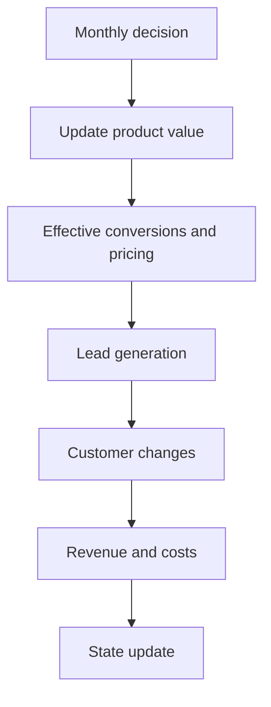

# OTAI Simulation Documentation

Use this page to explore the calculations from ``compute.py`` without duplicating logic.

## How the app works


The Streamlit app exposes three main tabs:

- **Assumptions**: Shows the fixed model inputs used by the simulator and the optimizer.
- **Results**: Displays KPIs, charts, and detailed tables after a run.
- **Documentation**: Explains the mechanics behind growth, pricing, and finance.

The simulation follows a monthly loop. For each month, the engine updates product value,
marketing-driven acquisition, conversions, revenue, costs, and then produces a new
immutable state snapshot. The charts and tables in the Results tab are derived directly
from these monthly state rows.


## Core assumptions


Assumptions define the business environment and constraints:

- **Acquisition dynamics**: CPC curves and SEO efficiency control how marketing spend
  translates into new leads and qualified traffic.
- **Conversion funnel**: Web-to-lead, lead-to-tier, and upgrade rates model the journey
  from visitor → free → paid → enterprise.
- **Pricing milestones**: Product value gates determine pro/enterprise pricing tiers.
- **Finance rules**: Taxes, operating costs, and debt mechanics ensure cash flow
  constraints are enforced.


## Decision inputs


Each month, you can adjust five decision levers: ads budget, SEO budget, development
budget, partner budget, and outreach budget. The simulator uses these to compute
marketing efficiency, product value improvements, and revenue growth. Optional price
overrides allow manual pricing experiments while keeping other assumptions intact.


## Decision optimizer


The optimizer (``decision_optimizer.choose_best_decisions_by_market_cap``) uses
Optuna's TPE sampler to search for the monthly budget schedule that maximizes
final market cap. It works by:

1. Sampling **knot values** for each budget lever (ads/SEO/dev/partner/outreach).
2. Interpolating those knots into smooth monthly multipliers.
3. Running the full simulation and scoring the outcome by market cap
   (TTM revenue × multiple + cash − 2×debt).
4. Rejecting trials with invalid states or negative cash flow.


## Monthly flow



## Calculation Formulas

### Effective CPC

```
CPC_eff = CPC_base × (1 + k × ln(1 + spend / spend_ref))
```

- **Base CPC**: 2.00 EUR
- **Sensitivity k**: 0.40
- **Reference spend**: 2,000 EUR

### Domain rating update

```
DR_next = DR × (1 - decay) + (DR_max - DR) × k × ln(1 + spend / spend_ref)
```

- **DR max**: 100
- **Sensitivity k**: 0.10
- **Reference spend**: 100 EUR
- **Monthly decay**: 1.0%

### Product value update

Product value accumulates with dev spend and depreciates at a fixed monthly rate.

- **PV min**: 0
- **Depreciation rate**: 2.0%

### Conversions and pricing

Conversion rates and pricing are determined by product value milestones.

| Metric | Rate |
| --- | --- |
| Web -> Lead | 5.00% |
| Lead -> Free | 40.00% |
| Lead -> Pro | 1.00% |
| Lead -> Enterprise | 0.50% |
| Free -> Pro | 1.00% |
| Pro -> Enterprise | 0.50% |
| Churn (Free) | 5.00% |
| Churn (Pro) | 5.00% |
| Churn (Enterprise) | 5.00% |

### Debt interest rate

- **Base annual rate**: 8.00%
